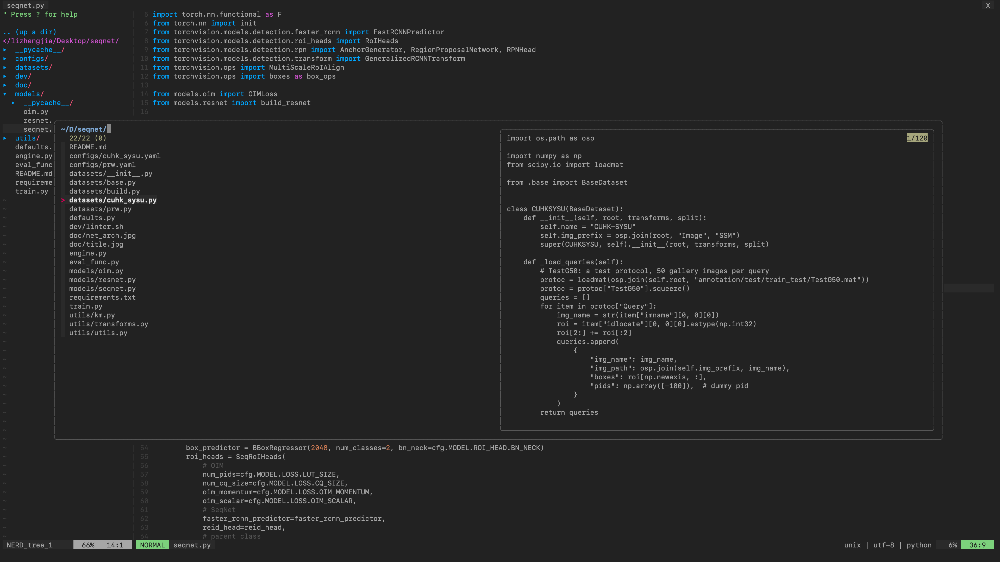

# vim

My vim configuration



## Installation

```
git clone --depth=1 https://github.com/serend1p1ty/vim.git ~/.vim_runtime
sh ~/.vim_runtime/install.sh
```

## Update plugins

```
sh ~/.vim_runtime/update_plugins.sh
```
